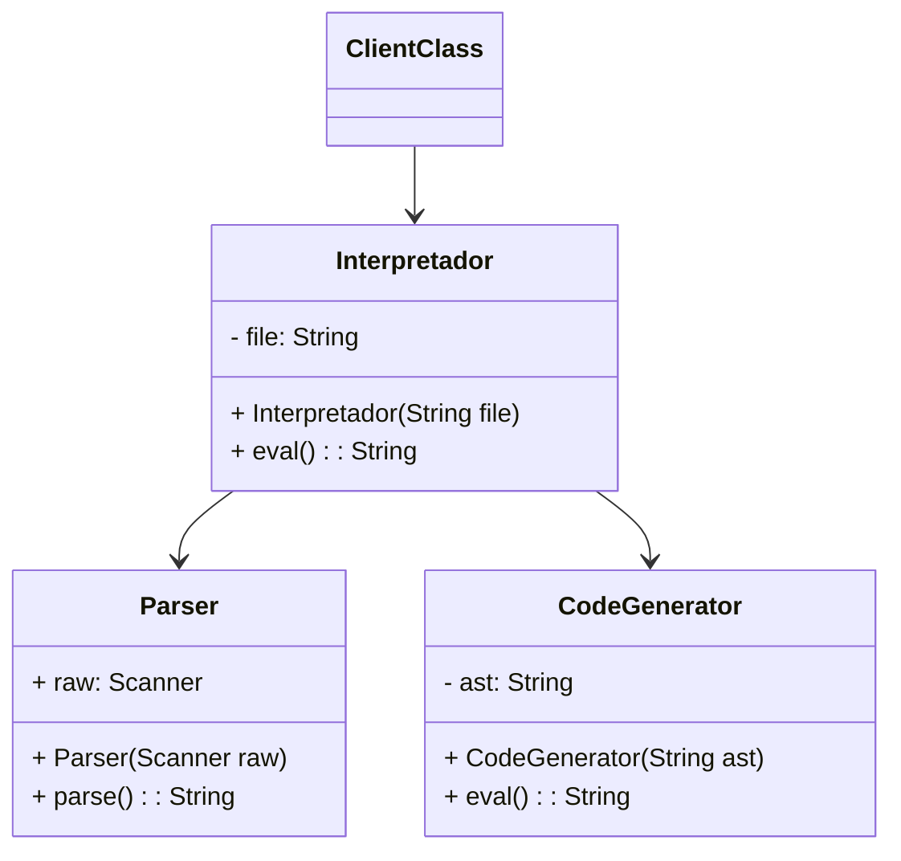

# Singleton

---

## Quando utilizar?
- Prover uma interface simplificada para o cliente.

## Solução / Estrutura
- Criar uma classe que conhece as classes necessárias para fazer algo.
- Delegue aos objetos externos a execução das requisições.
- Camada anticorrupção do DDD.

## Consequências (Pros / cons)
- Reduz complexidade do código cliente.
- Reduz acoplamento e aumenta manutenibilidade.
- Podem se tornar grandes e complexas e limitar o código externo.
  - Para evitar pode-se implementar múltiplas interfaces.
