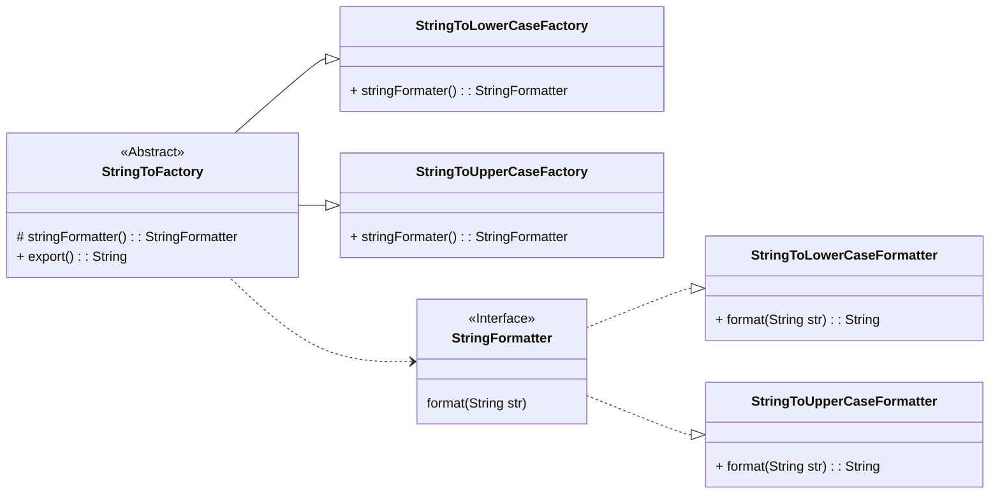

# Factory

---

## Quando utilizar?
- Quando uma aplicação precisa criar um objeto, sem expor a lógica de instanciação, e a classe concreta de implementação pode mudar.
- Decidir a classe concreta explicitamente viola o SRP, e a adição de novas implementações concretas viola o princípio de aberto fechado.

## Solução / Estrutura
- Criar uma abstração para representar o produto que será construído.
- Desenvolver classes concretas que implementem a abstração do produto.
- Criar uma abstração criadora que retorna uma abstração do produto.
- Desenvolver classes concretas que implementam a abstração criadora e retornam instâncias concretas das classes produto.
- Pode se substituir a classe abstrata por uma interface.

## Consequências (Pros / cons)
- Reduz o acoplamento entre a instância do produto e a lógica de criação do produto.
- Novos tipos de produtos podem ser incluídos no domínio sem alterar o código existente.
- Implementar o método fábrica em contextos desnecessários pode aumentar a complexidade do domínio.
