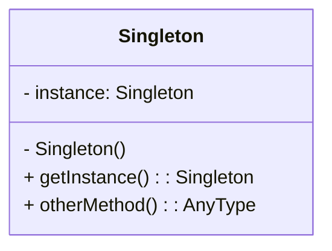

# Singleton

---

## Quando utilizar?
- Garantir que apenas uma instância da classe será criada.

## Solução / Estrutura
- Ocultar o construtor da classe (private ...)
- Definir um método pra retornar a instância da classe.

## Consequências
- Baixa testabilidade (dificil mockar)
- Alto acoplamento
- Menor escalabilidade

