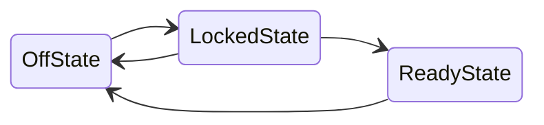
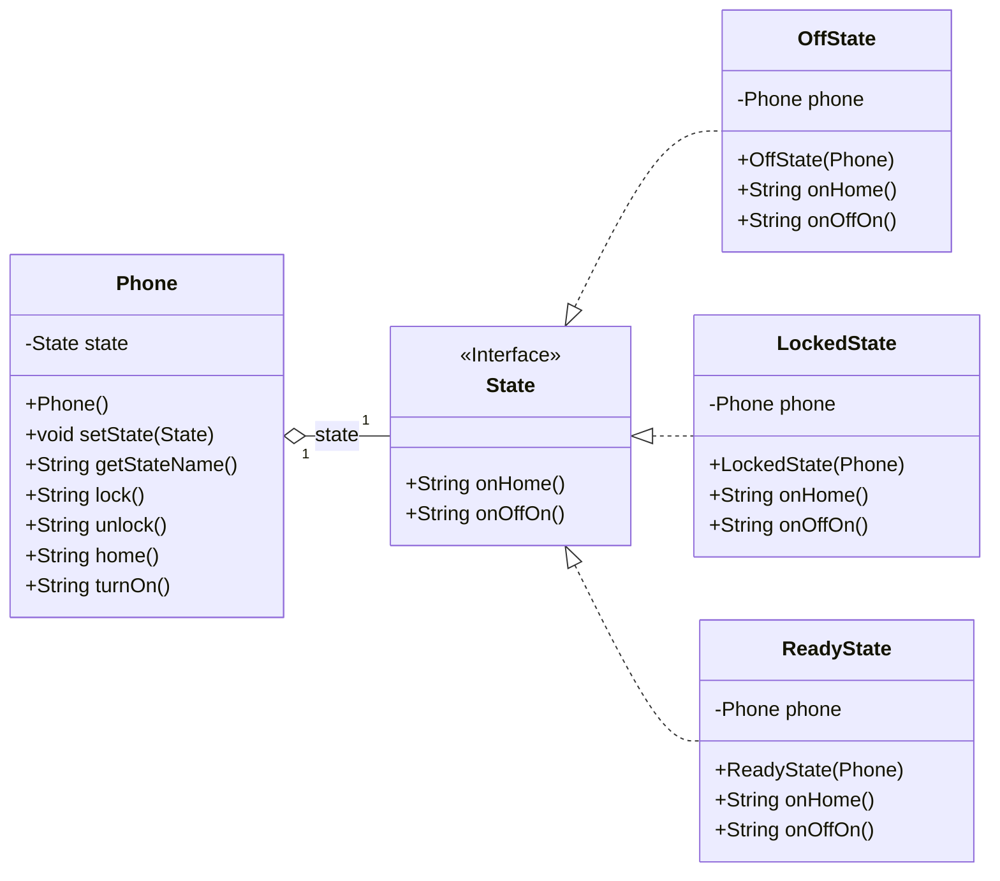

# State

---

## Quando utilizar?
- Quando um objeto deve mudar o seu comportamento quando seu estado muda.
- Adicionar novos estados muda a implementação dos comportamentos existentes.

## Solução / Estrutura
- Definir uma interface para encapsular o comportamento.
- Prover implementações para cada comportamento.
- Implementar o a máquina de estados com uma instância do estado atual.

## Consequências (Pros / Cons)
- Princípio aberto/fechado
- Transição de estado é representada pela troca entre objeto concreto.
- Estados como objetos protegem o contexto de inconsistências.
